# TomeRenderer and TomeConnector Architecture

## Mermaid Diagram

```mermaid
graph TB
    %% React Components
    subgraph "React Layer"
        TR[TomeRenderer<br/>React Component]
        STR[StructuralTomeConnector<br/>React Component]
        useTR[useTomeRenderer<br/>React Hook]
    end

    %% Core Classes
    subgraph "Core Classes"
        TB[TomeBase<br/>Abstract Base Class]
        VSM[ViewStateMachine<br/>State Machine with Views]
        TC[TomeConnector<br/>Tome Connection Manager]
    end

    %% Supporting Classes
    subgraph "Supporting Classes"
        VS[ViewStack<br/>View Management]
        MR[MachineRouter<br/>Path-based Routing]
        RC[RobotCopy<br/>Message Broker]
    end

    %% Interfaces
    subgraph "Connection Model"
        TConn[TomeConnection<br/>- sourceTome: VSM<br/>- targetTome: VSM<br/>- eventMapping<br/>- stateMapping<br/>- bidirectional]
    end

    %% TomeRenderer Relationships
    TR -->|uses| useTR
    useTR -->|accepts| TB
    useTR -->|accepts| VSM
    useTR -->|checks instanceof| TB
    useTR -->|if TomeBase| TB
    useTR -->|if ViewStateMachine| VSM
    
    TB -->|provides| getViewKey[getViewKey<br/>Returns current view key]
    TB -->|provides| observeViewKey[observeViewKey<br/>Subscribe to view key changes]
    TB -->|provides| render[render<br/>Returns ReactNode]
    
    VSM -->|implements| renderModel[render model: TModel<br/>Returns ReactNode]
    VSM -->|requires| renderParam[Model Parameter Required]
    
    %% TomeBase Structure
    TB -->|manages| VS
    TB -->|manages| MR
    TB -->|has| currentViewKey[Current View Key]
    TB -->|has| viewKeyObservers[View Key Observers]
    TB -->|has| childTomes[Child Tomes Map]
    
    %% ViewStateMachine Structure
    VSM -->|extends functionality| TB
    VSM -->|has| machine[XState Machine]
    VSM -->|has| viewStack[View Stack Array]
    VSM -->|has| stateHandlers[State Handlers Map]
    VSM -->|has| subMachines[Sub-Machines Map]
    VSM -->|has| MR
    VSM -->|has| parentMachine[Parent Machine Reference]
    VSM -->|optional| RC
    
    %% TomeConnector Relationships
    TC -->|manages| TConn
    TC -->|connects| VSM1[ViewStateMachine A]
    TC -->|connects| VSM2[ViewStateMachine B]
    TC -->|optional| RC
    TC -->|creates| traceId[Trace ID for Tracing]
    TC -->|creates| spanId[Span ID for Tracing]
    
    TConn -->|references| VSM1
    TConn -->|references| VSM2
    TConn -->|defines| eventMapping[Event Mapping<br/>source event → target event]
    TConn -->|defines| stateMapping[State Mapping<br/>source state → target state]
    
    %% StructuralTomeConnector
    STR -->|wraps| VSM
    STR -->|uses| StructuralSystem[StructuralSystem]
    STR -->|provides| TomeConnectorContext[Context:<br/>- machine<br/>- currentState<br/>- model<br/>- logEntries<br/>- sendEvent<br/>- updateModel]
    
    %% RobotCopy Integration
    RC -->|enables| tracing[Distributed Tracing]
    RC -->|enables| messaging[Inter-Tome Messaging]
    VSM -->|withRobotCopy| RC
    TC -->|tracks messages| RC
    
    %% Data Flow
    useTR -->|subscribes to| getViewKey
    useTR -->|calls| observeViewKey
    useTR -->|renders| render
    useTR -->|renders| renderModel
    
    VSM1 -->|sends events| TC
    TC -->|forwards events| VSM2
    VSM2 -->|sends events| TC
    TC -->|forwards events| VSM1
    
    %% Styling
    classDef reactComponent fill:#61dafb,stroke:#20232a,stroke-width:2px,color:#000
    classDef coreClass fill:#f39c12,stroke:#e67e22,stroke-width:2px,color:#000
    classDef supportClass fill:#3498db,stroke:#2980b9,stroke-width:2px,color:#fff
    classDef interface fill:#9b59b6,stroke:#8e44ad,stroke-width:2px,color:#fff
    
    class TR,STR,useTR reactComponent
    class TB,VSM,TC coreClass
    class VS,MR,RC supportClass
    class TConn interface
```



## Component Relationships

### TomeRenderer
- **Purpose**: React component wrapper for rendering Tomes
- **Accepts**: `TomeBase | ViewStateMachine<any>`
- **Key Features**:
  - Type guards to handle both TomeBase and ViewStateMachine
  - Subscribes to view key changes (TomeBase only)
  - Renders views from the tome
  - Provides loading state fallback

### TomeBase
- **Purpose**: Abstract base class for all Tome implementations
- **Key Features**:
  - View stack management via ViewStack
  - Machine routing via MachineRouter
  - View key observation for reactive updates
  - Child tome registration
  - `render()` method that returns ReactNode (no parameters)

### ViewStateMachine
- **Purpose**: State machine with integrated view rendering
- **Key Features**:
  - Extends TomeBase functionality
  - XState machine integration
  - State handlers with context
  - Sub-machine support
  - Router for inter-machine communication
  - `render(model: TModel)` method (requires model parameter)
  - Optional RobotCopy integration for messaging

### TomeConnector
- **Purpose**: Connects multiple ViewStateMachine instances
- **Key Features**:
  - Bidirectional event and state mapping
  - Connection health monitoring
  - Distributed tracing support via RobotCopy
  - Event and state transformers
  - Filtering support

### StructuralTomeConnector
- **Purpose**: React component that integrates with StructuralSystem
- **Key Features**:
  - Wraps ViewStateMachine in React context
  - Provides tome configuration from StructuralSystem
  - Manages machine lifecycle
  - Exposes context to children components

## Interaction Flow

1. **Rendering Flow**:
   ```
   TomeRenderer → useTomeRenderer → (TomeBase | ViewStateMachine) → render() → ReactNode
   ```

2. **Connection Flow**:
   ```
   TomeConnector.connect(VSM1, VSM2) → TomeConnection → Event/State Mapping → Bidirectional Communication
   ```

3. **State Change Flow**:
   ```
   ViewStateMachine State Change → TomeConnector → Event Mapping → Target ViewStateMachine → State Update
   ```

4. **Structural Integration**:
   ```
   StructuralTomeConnector → StructuralSystem → Tome Config → ViewStateMachine → React Context → Children
   ```

