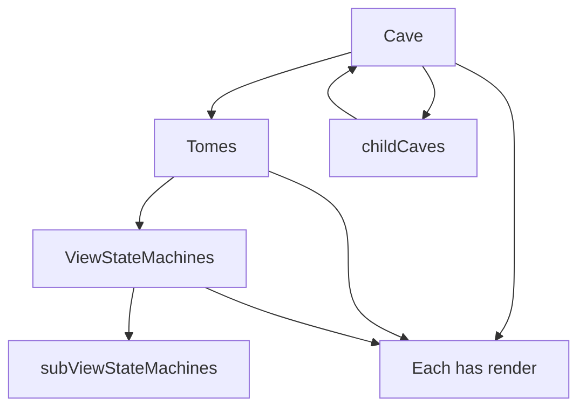

# Log-View-Machine Architecture and Cave

Single source of truth for ecommerce setup, component architecture, Cave (new structural system), RobotCopy, Tome, ViewStateMachine, generic editor, and future capabilities.

---

## 2.1 Ecommerce Setup

- **Cart / fish-burger as reference**: Component meta (category, tags, configuration, integration.endpoints), backend (fish-burger-backend, tome-server routes), RobotCopy switching backend (node vs kotlin via configurable toggles).
- **Checkout / order state**: Split between frontend ViewStateMachine and backend (tome-server SSR, fish-burger XState). Frontend holds UI state and sends messages via RobotCopy; backend owns order/cooking state and traces.

---

## 2.2 Component Architecture

- **Components**: UI units; mapped to Tomes via ComponentTomeMapping (today) or Cave/Tome (future). Metadata: meta.json (id, name, version, category, tags, files, configuration, integration).
- **Views**: React (and .tsx) views driven by ViewStateMachine `view()`/`render()`; one render() per Cave / Tome / ViewStateMachine layer.
- **XState**: ViewStateMachine wraps XState config; business logic and transitions live in machines; Tome holds machine configs.
- **Mod metadata**: Same meta.json pattern (id, version, dependencies, editableSections, pactTestProxy, etc.); SASS identity (SASSComponentIdentity) for theming/variables.
- **Headers / container components**: Today: routing + component mapping. With Cave: Cave → Tomes → ViewStateMachines with render() at each level; layout/headers are part of the structure.

---

## 2.3 Cave (New Structural System)

- **Factory**: `const Cave = (name: string, caveDescent: Spelunk) => CaveInstance`.
- **Type**: `Spelunk = { childCaves?: Record<string, Spelunk> }` (nested caves = hosted apps / subdomains).
- **Responsibilities**: Physical device/location description; contains Tomes; owns docker/warehousing; developer-readable; does not shell early.
- **API**:
  - `Cave('barney').getRoutedConfig(path: string)` — e.g. `getRoutedConfig('/loom')` or `getRoutedConfig('.')` for full tree.
  - `Cave('barney').getConfig()` — full cave config.
  - **`getRenderTarget(path: string)`** — returns `{ route?, container?, tomes?, tomeId? }` from the routed spelunk for the given path (convenience for apps that need "where to render" and which Tome to use).
  - **`getRenderKey(): string`** — stable key for this Cave in the render tree (e.g. React `key`); optional `renderKey` in Spelunk, default uses cave name.
  - **`observeViewKey(callback: (key: string) => void): () => void`** — subscribe to render-key updates; returns unsubscribe for cleanup (enables painless React integration).
  - From a "system of caves": include external cave and get routed config by path.
- **Subdomains**: Apply Cave settings (e.g. CSS/media); automatic History API and routing across subdomain boundaries; query and document.location for routing.
- **Hosted applications**: Builds propagate and declare at build time with main cave; may specify docker image names, dependencies; optional: address records, AWS, service discovery, jumpserver/PAM, https, oauth2, arbitrary props.
- **Optional wan-os ROM builds**: Cave may optionally support [wan-os rom-registry](https://github.com/john-holland/farey_for_fun/tree/file-system/wan_os/rom-registry) for ROM build and registry (artifacts, versioning, distribution). Purely optional.
- **Render contract**: Cave, Tome, and ViewStateMachine each have a `render()` that reduces view state for the whole Cave / Tome / ViewStateMachine.

### Node-example: Frontend Cave (Next.js) and Backend Cave (Express)

- The **node-example** can run as two Cave builds that talk to each other. **Backend**: Express app uses `createCaveServer` and **express-cave-adapter** to register Cave and Tomes; per-path Tome routes (e.g. `POST /api/fish-burger/cooking`) are registered from Tome config and forward to the correct state machines. **Frontend**: Next.js app in `example/node-example/frontend` uses Cave and `getRenderTarget()`; the **next-cave-adapter** provides `createProxyHandler()` so Next API routes proxy same-origin `/api/fish-burger/...` and `/api/registry` to the backend. The browser only talks to the Next app; the Next app forwards to the Express Cave backend. See node-example README for how to run backend and frontend together.

### Cave sync

- **Tome sync** (today): ViewStateMachine can be bound to a Tome via `synchronizeWithTome(tomeConfig)`; `view()` then does not warn when the machine is used from a Tome context.
- **Cave sync**: A Cave instance is "in sync" when it has been initialized and its Tomes are registered. **Tome** exposes an explicit **`isCaveSynchronized`** flag (readonly on TomeInstance): `true` when the Tome has been synchronized with a Cave (e.g. via `synchronizeWithCave(cave)`). ViewStateMachines/Tomes can optionally be marked as synchronized with a Cave so they are considered "inside" that Cave for config and render.

### Render location and render keys (Cave, Tome, ViewStateMachine)

- **Spelunk** can include optional **`route`**, **`container`**, and **`tomeId`** so each cave descent describes where the page/feature is rendered and which Tome to use (see Target roles: Cave = where, Tome = machine organization).
- **getRenderKey()** is available on **Cave**, **Tome** (TomeInstance), and **ViewStateMachine**. Each returns a stable string for use as a React `key`, render slot id, or cache key. Optional **renderKey** config: Cave (Spelunk), Tome (TomeConfig), ViewStateMachine (ViewStateMachineConfig); defaults are cave name, config.id, and machineId respectively. ViewStateMachine’s key updates when `clear()` is called (e.g. suffix `-clear1`, `-clear2`).
- **observeViewKey(callback)** is available on all three. The callback is invoked when the instance’s view/render key changes (or immediately with the current key); the method returns an **unsubscribe** function for cleanup. Use in React to drive `setState(renderKey)` or `key={renderKey}` without manual polling.

### React hooks: useCave, useTome, useViewStateMachineInstance

- **useCave(cave)** — returns `[cave, renderKey]`; subscribes to `cave.observeViewKey`; cleanup: unsubscribe only.
- **useTome(tome, options?)** — returns `[tome, renderKey]`; subscribes to `tome.observeViewKey`; cleanup: unsubscribe + `tome.stop()` + optional `options.unregister()`.
- **useViewStateMachineInstance(machine, options?)** — returns `[machine, renderKey]`; subscribes to `machine.observeViewKey`; cleanup: unsubscribe + `machine.stop()` + optional `options.unregister()`. Use when you don’t need the full `useViewStateMachine` state/send API and want the subscribe/cleanup pattern encapsulated.

These hooks act like **useEffect-compatible useState** for Cave, Tome, and ViewStateMachine so components avoid the manual pattern: set instance, subscribe via `observeViewKey(setRenderKey)`, and on cleanup unsubscribe + unregister + stop.

### Cave lifecycle: isInitialized and initialize()

- Cave instances can be **config-only** until `initialize()` is called (e.g. `Cave('barney').getRoutedConfig('/loom')` without loading Tomes).
- **`isInitialized`** (readonly on Cave): `false` until the Cave has been fully set up (Tomes loaded, routes resolved); `true` after `initialize()` has completed.
- **`isCaveSynchronized`** (readonly on **Tome**): Explicit sync flag on TomeInstance; set to `true` when the Tome is synchronized with a Cave (e.g. via `tome.synchronizeWithCave(cave)`). First-class for querying whether a Tome is inside a Cave.
- **`initialize()`**: Loads resources, attaches Tomes, and marks the Cave as initialized. After `initialize()`, `isInitialized` is `true`; before that, calls that depend on a fully loaded Cave (e.g. `render()`, or getRoutedConfig that needs live Tomes) may no-op or throw a clear error.

---

## 2.4 RobotCopy (Evolution)

- **Target**: Map **machine → client**. Client can be: a **Cave**; a **relative-routed statemachine** (e.g. `"../name"`); an **API endpoint** (with header details); a **GraphQL endpoint**.
- **Current**: Backend URL selection (configurable toggles, apiBasePath), tracing, `sendMessage(action, data)`.
- **Document**: Current (backend URL + sendMessage) vs target (generic client registry and resolution).

---

## 2.5 Tome (Evolution)

- **Holds**: RobotCopy configuration (which clients each machine uses); ViewStateMachines and routing; webpack-like proxy options.
- Tomes organize logic and store endpoint/machine configuration and overrides; they sit inside a Cave.

---

## 2.6 ViewStateMachine (Clarification)

- **Holds**: RobotCopy dependency config (required clients); RobotCopy instance config; **subViewStateMachines** (real and ProxyViewStateMachines as drop-in replacements).
- Each layer has `render()` for view state.

### View storage: RxDB and db in handlers

- View state / view model can be backed by **RxDB** in the browser so that state persists and can be queried.
- **`db`** is available in:
  - **withState handlers**: `StateContext` includes a `db` property (RxDB database instance or facade) when ViewStateMachine is configured with view storage.
  - **XState handler functions**: The machine context includes `db` when view storage is configured, so assign/actions can use `context.db`.
- ViewStateMachine accepts an optional RxDB database (or config to create one) in its config; when present, that instance is passed into `createStateContext` and into the machine context.

### View storage config: schema, find, findOne

- **Builder-style** config (chained after withState or as `withViewStorage({ ... })`):
  - **schema(type)**: RxDB schema type enforced before inserting; register schema for the collection(s) used for view storage.
  - **find(specs)**: Query RxDB with an array of property specs (e.g. `[{ "active": true }, { "visible": false }]`); results **directly update the view model** (e.g. set `context.model.items` or replace model).
  - **findOne(spec)**: Same as find but expect a single document and update the view model with that document.
- These run after the argument list (chained) and update the view model from RxDB when the state is entered or when the builder runs.

---

## 2.7 Generic Editor and Mod Building

- **Goal**: Review-inclusive hosted website to build mods: **3-panel in-depth tabbed editor** (left = library, center = HTML/CSS/JS/XState tabs, right = properties/preview); **light mod file viewer** (read-only, tree or list of mod files and metadata).
- **EditorWrapper (first-class option)**: **EditorWrapper** from wave-reader alignment is a first-class editor option in log-view-machine. It is a lightweight wrapper with ErrorBoundary, zero ace-editor dependency, and tree-shakeable. Use it alongside or instead of the SunEditor-based layout for the 3-panel tabbed editor. Export: `import { EditorWrapper } from 'log-view-machine'`. The generic editor supports it via `enableEditorWrapper` (config); when integrating with React, wrap the 3-panel layout in EditorWrapper.
- **SASS mod architecture**: Modable app is installed by using log-view-machine as a **React framework library**; backend is an **installable modable backend** (TomeManager + Cave-aware routing). Mods are SASS-themed components with meta and optional sticky-coin/donation.
- **Wave Reader SASS alignment**: SASS mechanisms are aligned with Wave Reader where they fit the plan. Adopted in log-view-machine: **view identity** variables and breakpoints (`_view-identity.scss`, `editor-wrapper.css`) matching SASSComponentIdentity (styleIdentity, responsiveBreakpoints). Use the same naming and structure so mods and EditorWrapper share one SASS contract. Left to wave-reader or app-specific: non-Cave routing, wave-reader-only runtime, and SASS that would conflict with existing SASSComponentIdentity; merge or extend rather than override.
- **Modding metadata: replaceable-component permissions**: To avoid a mod doing a **complete override** of an application, each product (or Cave/app identity) has a **replaceable-components** allow-list (slot IDs or component IDs that mods are allowed to override). A mod can only supply replacements for those slots; any other slot remains the default or product-provided component. Enforced at **install time** and at **runtime** when resolving which component to render (SaaS and client both respect the allow-list). Schema shape: `modMetadata: { replaceableComponents?: string[] }` (per product); product config: `replaceableComponents: ['library', 'cart']` (example: only library and cart can be replaced by mods).
- **Cave-first generic editor**: The generic editor is Cave-first: it uses Cave and the resolved **tomeId**/container everywhere it needs a scope (store, presence, permissions). The client fetches **GET /api/editor/render-target?path=...** to get `{ path, container, tomeId }` and uses that **tomeId** for all store and presence calls.
- **Editor store API and persistence override**: Editor UI state (current component id, sidebar state, layout) is stored via the **store API**: **GET/PUT /api/editor/store/:tomeId/:key** and **POST /api/editor/store/:tomeId/find**. The **editor-tome** (or equivalent) is configured in TomeConfig with **persistence: { enabled: true, adapter?: 'duckdb'|'redis'|'dynamodb'|'memcache', config? }**. `buildPersistenceRegistry(tomeConfigs, cavedbFactories)` and **getCaveDBAdapter(tomeId)** use the chosen backend per Tome, so the editor can use Redis/DynamoDB/Memcache per Tome.
- **dotcms-pam: permissions and presence**: The **dotcms-pam-cave-adapter** is attached as **req.cavePam** in node-example. **Permissions**: Before save or load of a component, the server calls **cavePam.checkPermission(user, resource, action)** (e.g. resource `editor/component/<id>`, action `read` or `write`). If the adapter returns false, the API returns 403. **Presence**: **GET /api/editor/presence?caveOrTomeId=...** returns who is viewing/editing; **POST /api/editor/presence** with `{ user, location }` updates presence. The client updates presence on load and on navigation and can display "who's here".
- **Optional Cave-store persistence backend**: The generic editor supports **persistenceBackend: 'local' | 'cave-store'** in GenericEditorConfig. When **cave-store**, **CaveStorePersistenceManager** (in persistence.js) implements the same interface as LocalPersistenceManager but uses the store API: **PUT/GET /api/editor/store/<editorTomeId>/component:<id>** (and optionally find for list). Components then live in the Tome's cavedb backend (duckdb/redis/dynamodb) instead of the local file system.

### Extension / Chrome messaging

- **Cave in extension contexts**: A Cave can be configured to run in a browser extension as **content**, **background**, or **popup**. Use **CaveConfig.extensionContext** (or **createCave(name, spelunk, { extensionContext })**) with `{ contextType, transport }` so code that needs to know the context or send messages uses the same abstraction.
- **CaveMessagingTransport**: Core defines **CaveMessagingTransport** (send, onMessage), **CaveMessage** (type, data, source, target, traceId), and **MessageTarget** ('background' | 'popup' | { to: 'content', tabId }). **createInMemoryTransport** is the sensible default for tests and non-extension; it supports **wireInMemoryTransportPair(a, b)** so two transports can send and receive.
- **chrome-messaging-cave-adapter**: The package **chrome-messaging-cave-adapter** provides **createChromeMessagingTransport({ contextType, tabId? })**. Content and popup can only send to `'background'`; background can send to `'popup'` or `{ to: 'content', tabId }`. Messages use chrome.runtime.sendMessage and chrome.tabs.sendMessage; send() returns a Promise that resolves with the receiver's sendResponse. Message shape is normalized (type, data, source, target, traceId) for wave-reader alignment.
- **RobotCopy in background**: For bidirectional flow, run Cave and **RobotCopy** in the **background** script. Content and popup use the Chrome transport to talk to background; background uses **RobotCopy** for HTTP to the backend (or **RobotCopyConfig.transport** to route sendMessage over a custom transport, e.g. Chrome messaging). So: content/popup <-> background (Chrome transport), background <-> backend (RobotCopy fetch or transport).
- **Example**: In background, create transport with `contextType: 'background'`, set up `transport.onMessage(handler)`. For actions that call the backend, handler calls `robotCopy.sendMessage(action, data)` and passes the result to sendResponse. Content and popup create their transport with `contextType: 'content'` or `'popup'` and call `transport.send('background', { type: action, data })` to get the same contract.

- **Next steps**: Formalize 3-panel + tabs; add Mod file viewer panel; wire editor to Cave/Tome once Cave exists.
- **Fish Burger Demo (refit)**: The fish burger demo uses **editor components** and **generic components** in both examples. **ts-example**: The tracing route (`/tracing`) wraps `FishBurgerWithTracing` in **EditorWrapper** from log-view-machine (title, description, componentId `fish-burger-demo`, router); the app imports `editor-wrapper.css` (or view-identity) so the chrome is styled; the component uses top-level class names `demo-container`, `demo-header`, `demo-content` for consistency with the generic-editor demo template. **node-example**: The `/fish-burger-demo` route serves the generic-editor **demo-template.html**, which is wrapped in **editor chrome** (`.editor-wrapper`, `data-component-id="fish-burger-demo"`, `.editor-wrapper-header`, `.editor-wrapper-content`, `.editor-wrapper-footer`) and links to shared **editor-wrapper.css** (a copy lives in `generic-editor/assets/css/core/`; canonical source is `log-view-machine/src/styles/editor-wrapper.css`). The page uses the generic-editor **generic components** (cart-component, fish-burger-demo component) via existing script/style links (main.js, demo-styles.css). Both demos thus share the same editor chrome and view-identity contract.

---

## 2.8 Crypto / Donation / Sticky Coins (Future)

- **Idea**: Crypto investment pooling based on user accrual; donation flow; "sticky coins" that last at least a week or two on mod install (e.g. visibility or rewards for mod author).
- **Persistence**: User-based app settings and sticky-coins are persisted via **duckdb-cavedb-adapter** (DuckDB-backed, arbitrary JSON put/get, find/findOne; per-Tome). See node-example `/api/editor/store/:tomeId/:key` and the adapter package.
- Document as **future capability**; plug-in points: mod metadata, backend wallet/accrual service, install lifecycle.

### SaaS contract for wave-reader and other products

- The **modding + generic editor SaaS** exposes a stable contract: **GET /registry**, per-path Tome routes (e.g. `/api/editor/*`, `/api/fish-burger/*`), optional mod endpoints. **Product/cave identity** can be passed so mods and editor state are scoped per product. Wave-reader (when refactored to Caves) and other products can **land on this SaaS** by pointing at the same registry and APIs; document **replaceable-components** and **SASS/view-identity** (log-view-machine as canonical) so wave-reader alignment is a config and style sync, not a fork.

---

## Examples (ts-example and node-example)

Both examples follow the same pattern: **one Cave per app**, **Tomes per feature**, **one RobotCopy**, and a clear **entry** and **render path** per component.

### ts-example (browser)

- **One RobotCopy**: Created once at app level via `createFishBurgerRobotCopy()`, provided through `RobotCopyProvider` so all screens use the same instance.
- **Root Cave**: Spelunk includes **route**, **container**, and **tomeId** per child (e.g. `tracing: { route: '/tracing', container: 'EditorWrapper', tomeId: 'fish-burger-tome', tomes: { fishBurger: {} } }`). Cave drives "where" to render; `cave.initialize()` is called once in App.
- **Route table from Cave**: App uses **`cave.getRenderTarget(path)`** to get `{ container, tomeId }` for the current path and looks up the Tome from a registry by `tomeId`. Tomes are created once (e.g. `createTome(fishBurgerTomeConfig)`, `createTome(connectionsTomeConfig)`), keyed by id; which Tome is used for a given route comes from Cave.
- **Tracing screen**: Receives **tome** from props (resolved via Cave + tome registry). Uses `tome.getMachine('fishBurger').useViewStateMachine(initialModel)` and **`tome.getRenderKey()`** for stable React keys; shared RobotCopy wired via `integrateWithViewStateMachine(machine)`.
- **Connections screen**: Receives **tome** from props (resolved via Cave + tome registry). Renders the Tome’s three machines and **TomeConnector**; optionally uses **useTome(tome)** or **getRenderKey()** for keys and painless React integration.
- **Messaging**: Between machines (same Tome): **TomeConnector**. Between app and backend: **RobotCopy**.

### node-example (server)

- **One RobotCopy**: Single instance in main-server; all fish-burger and Tome-related code uses it.
- **Root Cave**: Spelunk includes **route** (and optional **tomeId**) per child so Cave describes where each feature is exposed (e.g. fish-burger-api: route `/api/fish-burger`, fish-burger-demo: route `/fish-burger-demo`, generic-editor: route `/editor`). `cave.initialize()` during server startup.
- **TomeManager**: Uses the library **TomeManager** (Express `app`). Registers Tomes (e.g. fish-burger via **FishBurgerTomeConfig**); after each registration, `tome.synchronizeWithCave(cave)`.
- **Entry points**: Routes remain the single entry per feature; Cave documents the mapping (path to handler/Tome). Fish-burger API handlers **delegate to the registered fish-burger Tome**: they call `tomeManager.sendTomeMessage('fish-burger-tome', 'cookingMachine', event, data)` and `tomeManager.getTomeMachineState(...)` so backend state lives in the Tome’s ViewStateMachines.
- **Render path**: For API, “render” is the JSON response (sendMessage → result). For HTML pages (e.g. fish-burger-demo), the render path is the existing sendFile or template.

### Shared conventions

- **Entry**: Each component (screen or server feature) has exactly one route or mount (e.g. `/tracing` → TracingScreen, `/api/fish-burger/start` → handler that uses the fish-burger Tome).
- **Render path**: From that entry, render is deterministic: Cave (optional) → Tome → ViewStateMachine(s) views; in Node, “render” for API is sendMessage/response.
- **Messaging**: Between machines (same Tome): TomeConnector. Between app and backend: RobotCopy. Between Tomes (if needed): pass RobotCopy or a small message bus; prefer TomeConnector within a Tome and RobotCopy for backend.

---

## Security

### Script-injection prevention

Utilities for escaping and safely parsing user or cross-boundary content (message payloads, view state, API request/response bodies) to reduce XSS and script injection risk. Available in all environments (browser, Node, adapters).

- **escapeText(str)** — Encode `&`, `<`, `>`, `"`, `'`, `` ` `` as HTML entities. Use when interpolating into HTML text nodes or attributes. Output is safe for those contexts.
- **unescapeText(str)** — Reverse the encoding from escapeText. Use when round-tripping data that was escaped for display and must be restored for editing or processing.
- **parseHtml(html, options?)** — Parse HTML into a safe representation (allowed tags only, scripts stripped by default). Returns `{ safe, errors? }`. Use the `safe` string only in a sanitized insertion context (e.g. whitelisted tags in a safe container); never assign to raw innerHTML. In browser uses DOMParser; in Node uses a lightweight strip and tag allowlist.

Server adapters and RobotCopy/TomeManager do not call these automatically; application and adapter code should use them when handling user or external text (e.g. escaping before sending, parseHtml when accepting HTML payloads).

### Message token (CSRF-style) and wave-reader alignment

Cross-boundary messages (Cave-to-Cave, Tome-to-Tome, VSM-to-remote) can be protected with origin-bound tokens. The library provides a small messaging token module: **generateToken** / **generateTokenAsync** (salt + hash of `salt + channelId + payloadSummary + secret`), and **validateToken**. Token shape includes optional `originId`, `caveId`, `tomeId`, `expiresAt`. Use a configurable secret (env or Cave security config).

- **RobotCopy.sendMessage:** When `messageTokenProvider` is set in config, the outbound request includes the token (e.g. header `X-Cave-Message-Token` or body field). The server validates; RobotCopy does not validate (it sends).
- **Server (adapter):** Optional `validateMessageToken(req)` in the adapter contract; when Cave config or adapter options enable message-token validation, middleware can reject (403) state-changing requests missing or invalid token.
- **Wave-reader alignment:** Wave-reader is not in this repo. When it is in scope, the same conceptual model applies: channel = (origin, context) in popup/background/content; same salt-then-hash idea so the same token shape and validation can be used or refactored to match wave-reader’s exact API.

### Resource monitoring and metrics

Resource and bandwidth metrics are recorded via an overridable **ResourceMonitor** and reported in a shape compatible with AWS CloudWatch and Hystrix so the same pipeline can feed dashboards or other backends.

- **MetricsSnapshot / ResourceMonitor:** Core types include `requestCount`, `errorCount`, `bytesIn`, `bytesOut`, `latencyMs` (e.g. p50/p95/p99), optional `circuitState`, `timestamp`, and `dimensions` (CaveId, TomeId, route, adapter name). **ResourceMonitor** provides `trackRequest(meta)`, `trackCircuit(name, state)`, and `getSnapshot()`. Optional **BandwidthTracker** for `trackBandwidth(bytesIn, bytesOut, labels)`.
- **Default reporter:** A **MetricsReporter** implements the monitor and periodically (or on demand) calls a pluggable `reportTo(snapshot)`. Default can post to a GA-like endpoint (e.g. GA4 Measurement Protocol or custom collector); callers can replace `reportTo` with a function that pushes to CloudWatch (PutMetricData shape), Hystrix stream, or another backend. The snapshot shape is documented so AWS and Hystrix adapters can be written without changing core.
- **Integration:** Cave server adapter (e.g. Express) can take optional `resourceMonitor` and `metricsReporter` in context; middleware calls `trackRequest` with path, method, bytes, latency, status. **RobotCopy** can take an optional ResourceMonitor and record bytes, latency, and success/failure for cross-cave traffic in the same metrics.

### Cost controls: throttling, retries, circuit breakers

Monitoring feeds **throttling**, **retry/try-again**, and **circuit breakers** so resource use stays within Bat Armor data-transfer and cost controls.

- **Throttling:** When a ResourceMonitor (or a dedicated window) reports that request count or bandwidth exceeds configured thresholds (e.g. `maxRequestsPerMinute`, `maxBytesPerMinute`, `windowMs`), the adapter or RobotCopy can return **429** with `Retry-After`, or queue and process later. **ThrottlePolicy** reads from the monitor or an in-memory window and signals over-limit; middleware or RobotCopy checks before processing.
- **Try-agains (retry with backoff):** **RobotCopy.sendMessage** supports **retryPolicy** (e.g. `initialDelayMs`, `maxDelayMs`, `multiplier`, `maxRetries`, `jitter`). On transient failure (5xx, network error), it retries with exponential backoff; optionally respects `Retry-After`. Server-side “try again” is client responsibility: we return 429 or 503 with Retry-After.
- **Circuit breaker (shutoffs):** A **CircuitBreaker** uses ResourceMonitor (or MetricsSnapshot) to transition: **Closed** (normal); **Open** when failure count or error rate exceeds threshold (reject requests immediately, e.g. 503); **Half-open** after `resetMs` with limited probes. Circuit state is exposed in MetricsSnapshot so GA/AWS/Hystrix dashboards can show it. RobotCopy and the server adapter can wrap sendMessage or selected routes with a circuit breaker per backend or per route.
- **Config:** Cave or adapter config supports optional `throttle`, `retryPolicy` (full backoff), and `circuitBreaker` (threshold, resetMs, name). These can be overridden per-route or per-tome in TomeConfig.routing if needed.

### Data transfer: CORS and HTTP/2

- **CORS:** Server adapter (and/or Cave config) supports **cors**: `boolean` or `{ origin?, credentials?, methods?, allowedHeaders?, maxAge? }`. Express adapter applies `cors` middleware when set. For cross-origin backends, the server must send proper CORS headers (RobotCopy in the browser does not set CORS; config can set `credentials` for cookies).
- **HTTP/2:** Adapter options support **http2**: `boolean` or `{ allowHTTP1? }`. When true, the Node server can use `http2.createSecureServer` or `http2.createServer` (with TLS if configured). In production, HTTP/2 is often terminated at a reverse proxy; the option applies when the Node process is the TLS endpoint. RobotCopy can take **http2** / **useHTTP2** for environment-specific or future HTTP/2 client behavior.

---

## Backend storage: DuckDB

- **Frontend view storage**: RxDB in the browser.
- **Backend storage**: A **DuckDB-supported storage mechanism** for the backend (Node/TomeManager or installable modable backend) — e.g. logs, state snapshots, Tome persistence.
- **Scope**: Storage adapter interface (e.g. `query(sql, params)`, `insert(table, row)`, `close()`) implemented with DuckDB; optional dependency so the library works without DuckDB if not configured.

---

## Overlap and Wave-Reader

- **Wave-reader**: Not in this repo; architecture review and Cave/Tome/ViewStateMachine boundaries should be aligned with wave-reader where applicable (e.g. shared Cave or routing concepts) when that codebase is in scope.
- **Overlap**: Both projects benefit from a single structural model (Cave), clear Tome (config + routing) and ViewStateMachine (logic + render) roles, and a single RobotCopy contract (machine → client).
