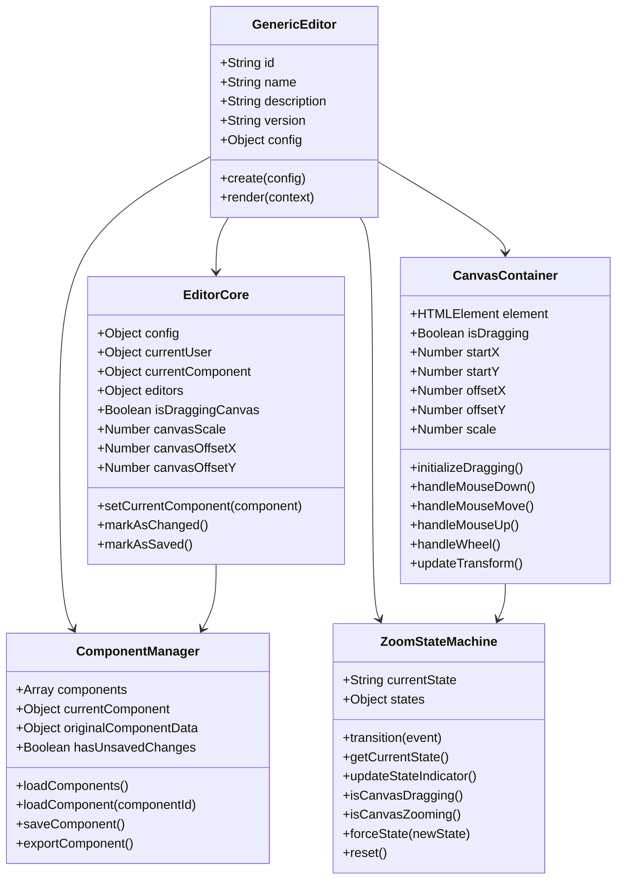
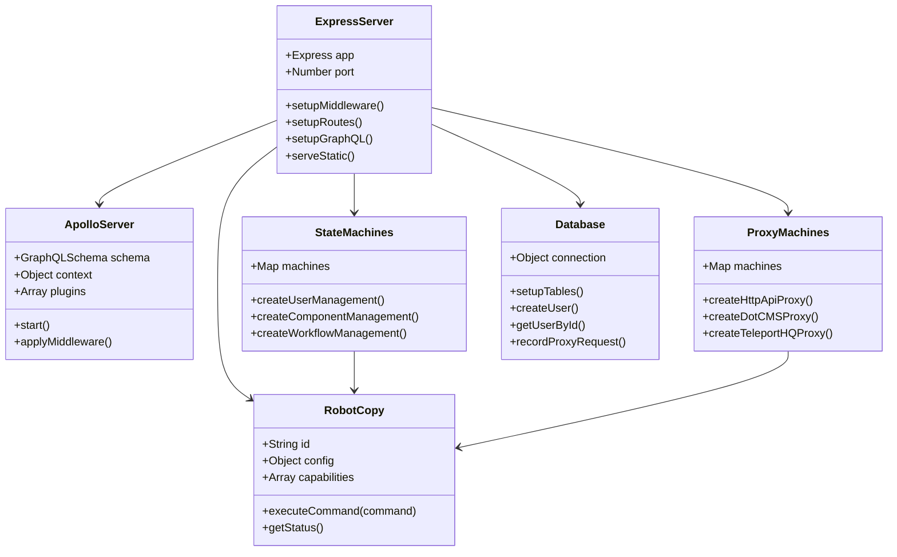
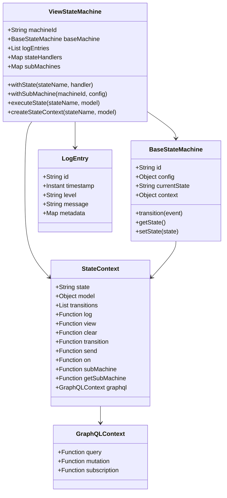
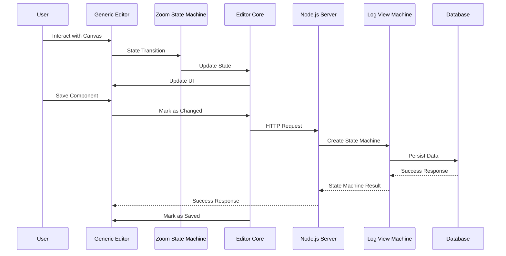
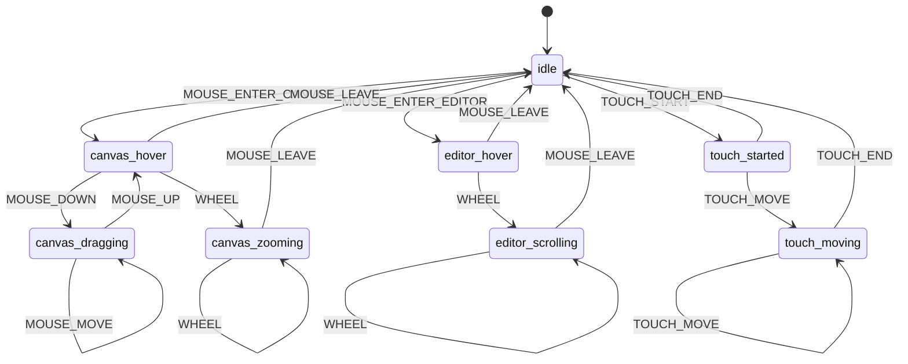

# Generic Editor Architecture UML

## System Overview
The Generic Editor is a comprehensive component builder that integrates with the Log View Machine backend through state machines and robot proxy systems. It provides a visual editor for HTML, CSS, JavaScript, and XState components with real-time preview and state management.

## Architecture Components

```mermaid
graph TB
    %% Frontend Components
    subgraph "Frontend - Generic Editor"
        GE[Generic Editor HTML]
        GE_CSS[Editor CSS]
        GE_JS[Editor JavaScript]
        
        subgraph "Core Modules"
            EC[Editor Core]
            CM[Component Manager]
            ZSM[Zoom State Machine]
            MM[Main Module]
        end
        
        subgraph "Editor Panels"
            HTML_ED[HTML Editor]
            CSS_ED[CSS Editor]
            JS_ED[JavaScript Editor]
            XS_ED[XState Editor]
            CL[Component Library]
        end
        
        subgraph "Canvas System"
            CC[Canvas Container]
            SEW[Sun Editor Wrapper]
            ZC[Zoom Controls]
            GC[Gesture Controller]
        end
    end
    
    %% Backend Integration
    subgraph "Backend - Node.js Server"
        SERVER[Express Server]
        APOLLO[Apollo GraphQL Server]
        DB[(SQLite Database)]
        
        subgraph "State Machines"
            SM[State Machines]
            PM[Proxy Machines]
            PTP[Pact Test Proxy]
        end
        
        subgraph "Robot Copy System"
            RC[Robot Copy]
            RC_SM[Robot Copy State Machines]
        end
    end
    
    %% Log View Machine
    subgraph "Log View Machine - Kotlin Core"
        LVM[Log View Machine]
        VSM[View State Machine]
        BSM[Base State Machine]
        GQL[GraphQL Context]
        
        subgraph "Core Features"
            LOG[Logging System]
            TRACE[Tracing System]
            SSR[Server-Side Rendering]
        end
    end
    
    %% External Systems
    subgraph "External Integrations"
        DOTCMS[DotCMS]
        TELEPORT[TeleportHQ]
        PACT[Pact Testing]
    end
    
    %% Connections
    GE --> SERVER
    GE_CSS --> SERVER
    GE_JS --> SERVER
    
    EC --> CM
    EC --> ZSM
    EC --> MM
    
    HTML_ED --> SEW
    CSS_ED --> SEW
    JS_ED --> SEW
    XS_ED --> SEW
    
    CC --> ZC
    SEW --> GC
    ZC --> ZSM
    
    SERVER --> APOLLO
    SERVER --> DB
    SERVER --> SM
    SERVER --> PM
    SERVER --> RC
    
    SM --> LVM
    PM --> LVM
    RC --> LVM
    
    VSM --> BSM
    BSM --> GQL
    GQL --> LOG
    GQL --> TRACE
    GQL --> SSR
    
    PM --> DOTCMS
    PM --> TELEPORT
    PTP --> PACT
```

## Detailed Component Relationships

### 1. Frontend Architecture

### 2. Backend Integration

### 3. Log View Machine Integration

### 4. Data Flow Architecture

### 5. State Machine States

## Key Integration Points

### 1. **State Machine Integration**
- Generic Editor uses XState for frontend state management
- Backend creates ViewStateMachine instances from log-view-machine
- State transitions are logged and traced through the system

### 2. **Robot Proxy System**
- RobotCopy instances handle external API interactions
- Proxy machines wrap external services (DotCMS, TeleportHQ)
- Pact testing framework validates component contracts

### 3. **Canvas System**
- Zoom State Machine manages canvas interactions
- Transform updates are synchronized across all editor panels
- Touch and mouse events are unified through gesture analysis

### 4. **Component Management**
- Components are stored in SQLite database
- GraphQL API provides CRUD operations
- Real-time preview with live editing capabilities

### 5. **Logging and Tracing**
- All state transitions are logged with metadata
- OpenTelemetry integration for distributed tracing
- Log warehouse for long-term storage and analysis

## Performance Characteristics

- **Frontend**: Real-time canvas updates with 60fps target
- **Backend**: Async state machine execution with coroutines
- **Database**: SQLite with connection pooling
- **Caching**: In-memory state caching with persistence
- **Scaling**: Horizontal scaling through stateless design

## Security Features

- **CORS**: Configurable cross-origin restrictions
- **Rate Limiting**: Request throttling and abuse prevention
- **Input Validation**: Sanitized component templates
- **Authentication**: User session management
- **Content Security Policy**: XSS prevention

This architecture provides a robust, scalable foundation for component editing with comprehensive state management, real-time collaboration, and enterprise-grade logging and tracing capabilities.

